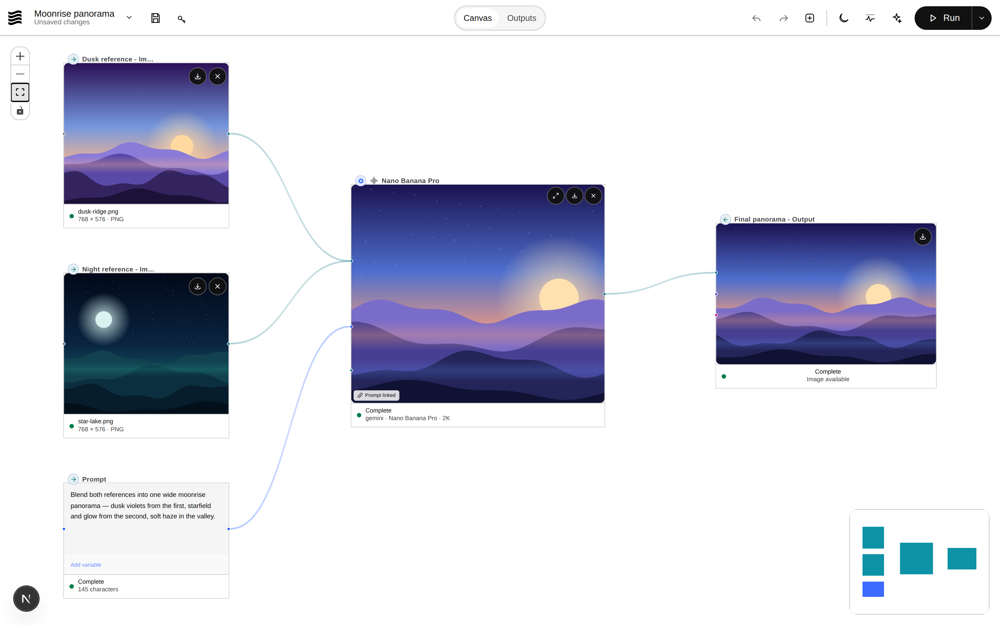
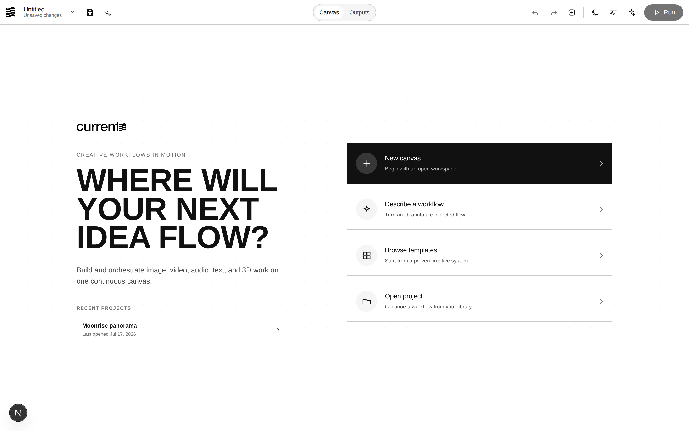

# Current

**The open-source visual workspace for AI media workflows — run it on your own terms.**

Arrange typed nodes on an infinite canvas, connect them, and run the graph in dependency order. Images, video, audio, text, and 3D stay together in one continuous flow — in the browser, from the CLI, over an API, or driven by an AI agent through MCP. Bring your own keys; nothing is locked to a hosted service.

<p align="center">
  <picture>
    <source media="(prefers-color-scheme: dark)" srcset="public/screenshots/workflow-dark.png">
    
  </picture>
  <br />
  <picture>
    <source media="(prefers-color-scheme: dark)" srcset="public/screenshots/launchpad-dark.png">
    
  </picture>
</p>

## Why Current

- **The node is a mini-app.** Type the prompt on the node, pick the model on the node, run the node by itself — with its real cost on the button — and flip through its generation history without opening a panel.
- **Your keys, your machine, your files.** Provider keys stay in your environment or browser; projects and media save to local directories you choose.
- **Not just a canvas.** Every workflow also runs headlessly from the CLI or `POST /api/run`, and ships with an MCP server so Claude Code, Claude Desktop, or Cursor can build and run flows for you.
- **Free local processing.** Image ops (rotate, crop, blur, composite, text) and video ops (reverse, speed, boomerang, mute) run on-device at $0 — no API round-trips for the mechanical steps.

## Highlights

| Capability | Details |
| --- | --- |
| Visual canvas | Drag, connect, group, pan, zoom, and inspect workflows on a desktop canvas with light and dark appearances. |
| Typed connections | Image, text, video, audio, and 3D handles with category accents prevent incompatible wiring. |
| In-node everything | Inline prompts, model pickers, 1–4 variations per run, and a Run button that shows the estimated cost. |
| Inpainting masks | Paint a mask in the annotation editor; the generator edits only that region. Pad-then-mask gives you outpainting. |
| Local action nodes | Image Action and Video Action run deterministic edits on-device — free, instant, offline. |
| Many providers | Gemini, OpenAI, Anthropic, Replicate, fal.ai, Kie.ai, and WaveSpeed models from a single workflow. |
| Local models | Ollama LLMs and ComfyUI image checkpoints run fully offline on your hardware — free, private, no API key. |
| Fullscreen viewer | Press `F` on a generation node for a fullscreen viewer with history grid, promote-to-input, and downloads. |
| Bulk editing | Select several generators and change model, aspect ratio, or variations across all of them at once. |
| Run as an app | Switch to the App view and any workflow becomes a typed form — fill the inputs, hit Run, collect results. No graph in sight. |
| Headless runs | Execute any workflow from the CLI or `POST /api/run` — no browser required. |
| MCP server | Let AI agents validate and run your local workflows and browse the node/model catalogs. |
| Local projects | Save workflow files and media to a local project directory; costs are tracked per workflow. |

## Quick start

### Requirements

- Node.js 20.9 or later
- npm
- A provider API key for the models you plan to run

### Install and run

```bash
git clone https://github.com/csprech/current.git
cd current
npm install
npm run dev
```

Open [http://localhost:3000](http://localhost:3000).

If you do not create `.env.local`, you can add API keys from the key button in the command bar once the app is running.

## Configuration

Create `.env.local` in the repository root when you prefer environment configuration (all keys optional — add only the providers you use):

```env
GEMINI_API_KEY=your_gemini_api_key      # Gemini image + LLM generation
OPENAI_API_KEY=your_openai_api_key      # OpenAI LLM provider
ANTHROPIC_API_KEY=your_anthropic_key    # Anthropic LLM provider
REPLICATE_API_KEY=your_replicate_key    # Replicate models
FAL_API_KEY=your_fal_key                # fal.ai models
KIE_API_KEY=your_kie_api_key            # Kie.ai models (Sora, Veo, Kling, ...)
WAVESPEED_API_KEY=your_wavespeed_key    # WaveSpeed models
OLLAMA_URL=http://localhost:11434       # Local Ollama daemon (optional; no key needed)
COMFYUI_URL=http://localhost:8188       # Local ComfyUI daemon (optional; no key needed)
```

Keep `.env.local` private. It should never be committed.

## Core workflow

1. Create a canvas or open a project.
2. Add nodes from the palette (or `Shift+P/I/G/V/L/A/T` shortcuts).
3. Connect matching handles — image to image, text to text, audio to audio.
4. Type prompts directly on generation nodes, or wire in prompt nodes.
5. Run everything with `Cmd/Ctrl+Enter`, or run one node from its header — the button shows what it will cost.
6. Review results in Outputs or the fullscreen viewer (`F`), then reuse an asset or keep refining.

### Inpainting

Open any image in the annotation editor, pick the **Mask** tool, and paint the region to change. Wire the annotation's **Mask** output to the generator's **Mask** input alongside the image, prompt the edit, and run — the model is instructed to change only the masked region. For outpainting, pad the canvas first with an Image Action ("Change aspect ratio → Pad"), then mask the borders.

## Headless runs

Any saved or exported workflow runs without the canvas — from scripts, cron, or CI. With a Current server running (`npm run dev` or `npm run start`):

```bash
npm run workflow -- ./my-workflow.json \
  --input "Product Photo=@./shot.png" \
  --input "Prompt=a watercolor fox on white" \
  --out ./outputs
```

Inputs are matched by node title or id: `name=@file` loads media into an input node, `name=text` sets prompt text. Every output node's media is written to the `--out` directory, and the same engine is available directly at `POST /api/run` for your own integrations. Provider keys come from the server environment.

Supported headlessly today: input nodes, prompts, image/video/audio generation, LLM text, and outputs. Canvas-coupled nodes (annotation, image/video actions, routing, loops) report a clear unsupported error rather than failing silently.

## MCP server (drive Current from AI agents)

Current ships an MCP server so Claude Code, Claude Desktop, Cursor, or any MCP client can validate and run your local workflows and browse the node/model catalogs — no cloud, no seat license. With the app running:

```bash
claude mcp add current -- node scripts/mcp-server.mjs
```

or add it to a client config:

```json
{
  "command": "node",
  "args": ["scripts/mcp-server.mjs"],
  "env": { "CURRENT_SERVER": "http://localhost:3000" }
}
```

Tools exposed: `run_workflow` (execute a workflow file or inline graph with typed inputs, outputs saved to disk), `validate_workflow`, `list_node_types`, and `list_models`.

## Included node families

| Family | Examples |
| --- | --- |
| Inputs | Image, Video, and Audio Input, Prompt, Array, Prompt Constructor, 3D Viewer |
| Generation | Image, LLM, Audio, Video, and 3D generation |
| Transform | Annotation + Mask, Image Action, Video Action, Split Grid, Video Trim, Frame Grab, Remove Background, Image Compare |
| Control | Router, Switch, Conditional Switch, Ease Curve |
| Output | Output and Output Gallery |

## Keyboard shortcuts

| Shortcut | Action |
| --- | --- |
| `Cmd/Ctrl + Enter` | Run the workflow |
| `Shift + P / I / Y` | Add a prompt / image input / video input node |
| `Shift + G / V / L` | Add an image / video / LLM generation node |
| `Shift + A / T / R` | Add an annotation / audio / router node |
| `F` | Open the fullscreen viewer on a selected generation node |
| `H` / `V` / `G` | Stack the selection horizontally / vertically / in a grid |
| `?` | Show all shortcuts |

## Development

```bash
npm run dev       # Start the local Next.js server
npm run test:run  # Run the Vitest suite once
npm run build     # Create a production build
npm run start     # Serve a production build
npm run workflow  # Headless runner CLI
npm run mcp       # MCP server over stdio
```

### Architecture

- **Next.js App Router** for the desktop web application
- **React Flow** for the node editor and typed connections
- **Zustand** for workflow state, execution, and persistence
- **Konva** for image annotation and masking
- **mediabunny** (WebCodecs) for on-device video processing

The main workflow engine lives in [`src/store/workflowStore.ts`](src/store/workflowStore.ts); the headless engine in [`src/lib/headless/runWorkflow.ts`](src/lib/headless/runWorkflow.ts). The design system is documented in [`docs/design-system.md`](docs/design-system.md), and contributor guidance in [`CLAUDE.md`](CLAUDE.md).

## License

MIT. See [LICENSE](LICENSE).
